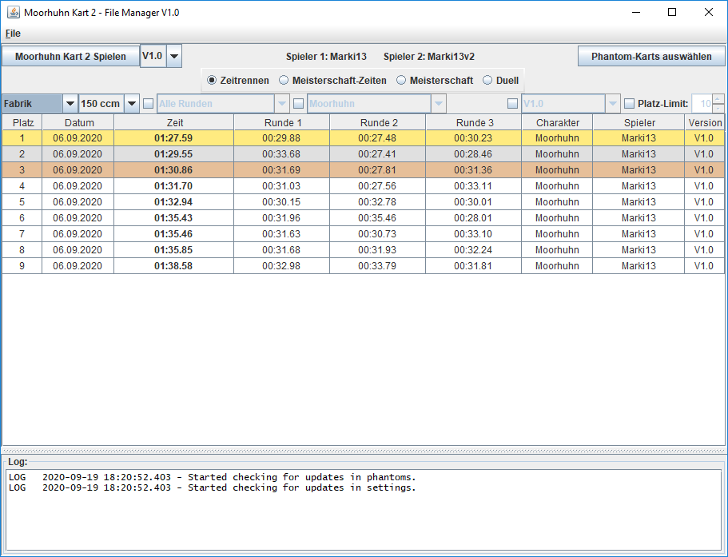
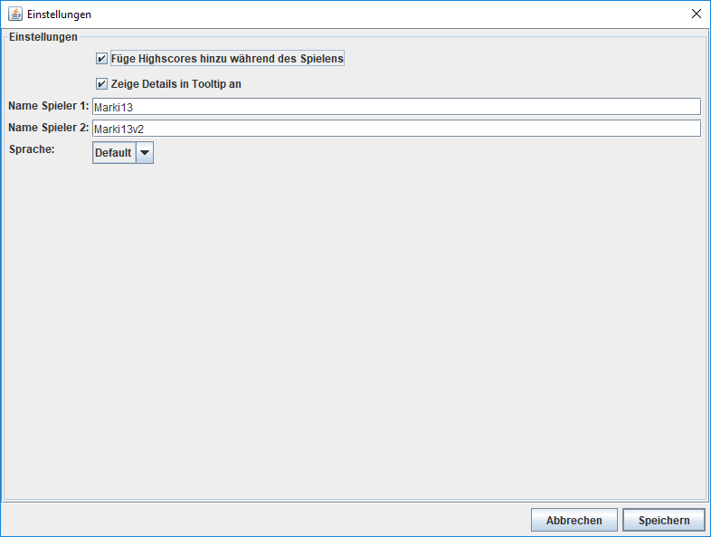
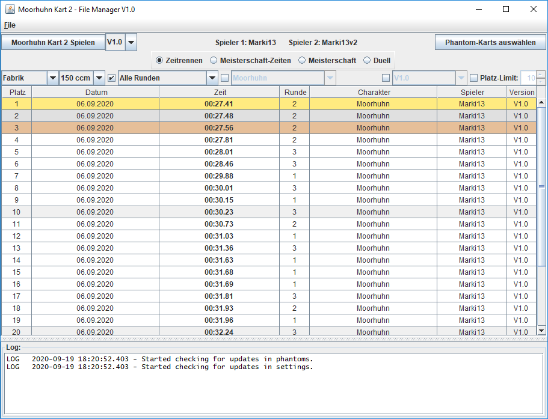
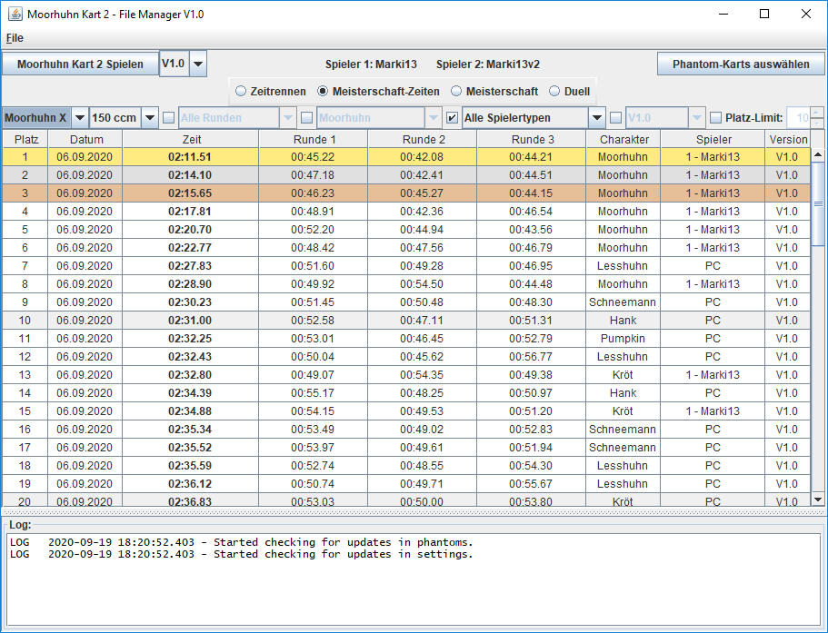
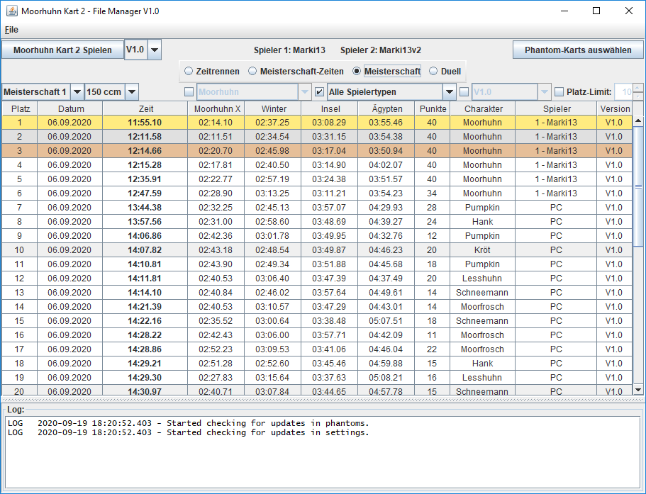
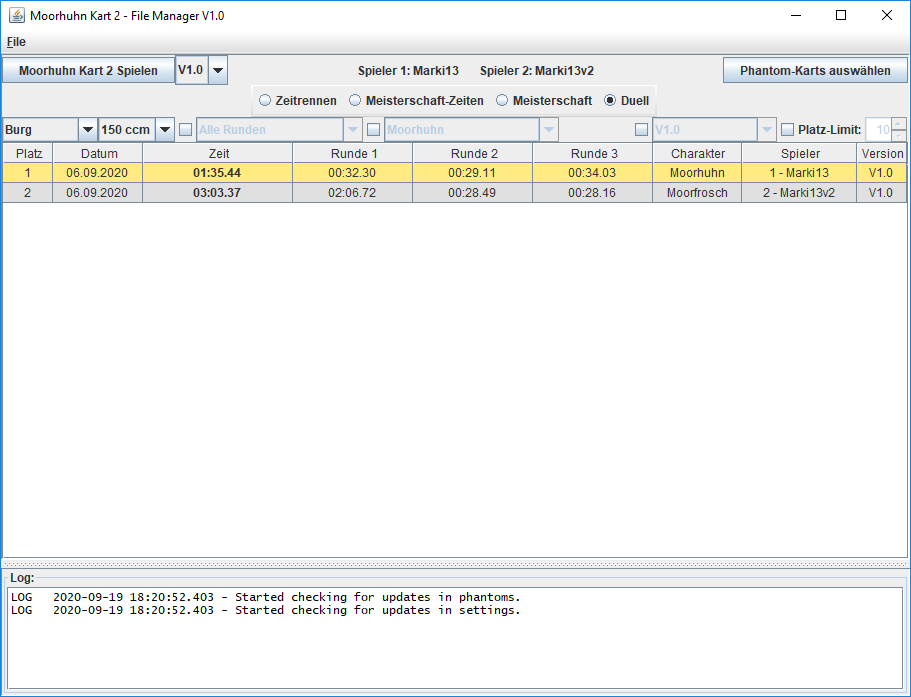
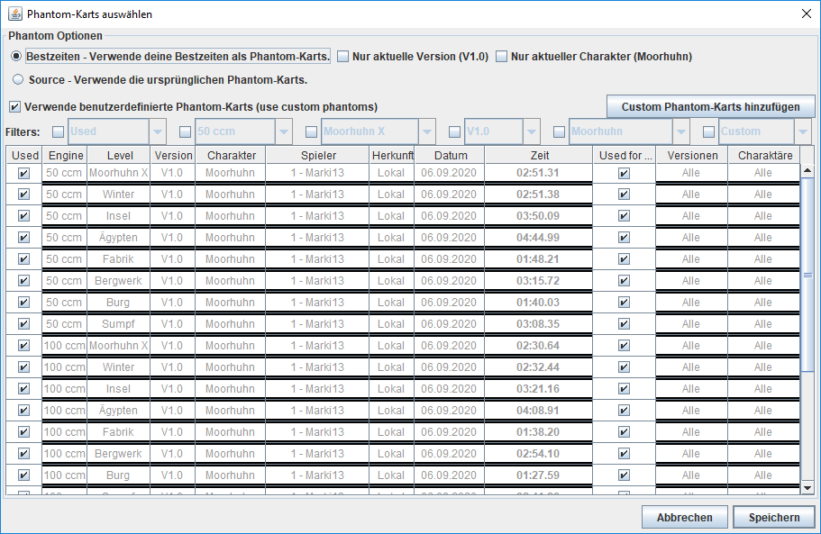
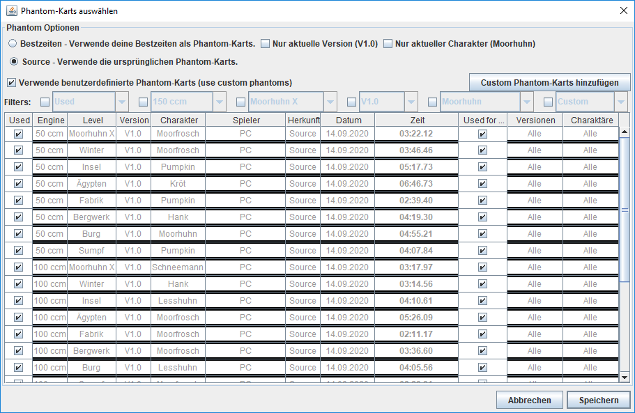
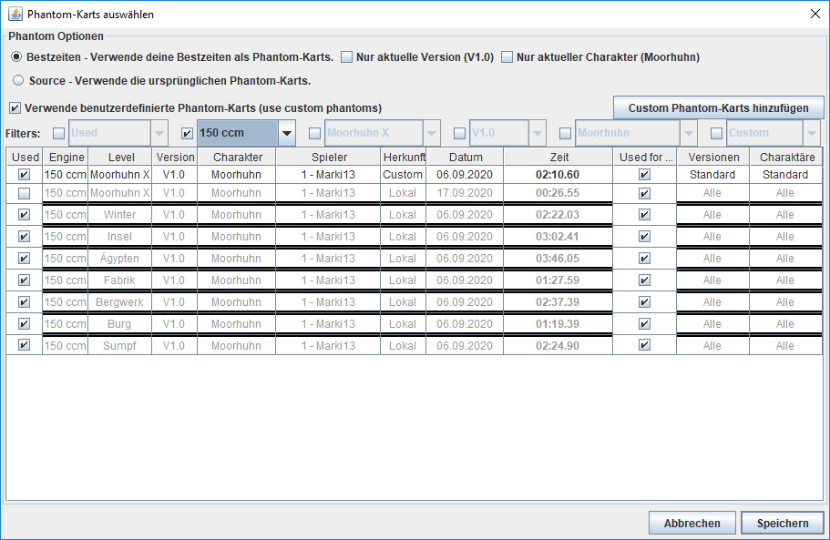

# Moorhuhn Kart 2 - File Manager

## Installation

Follow these steps to install **Moorhuhn Kart 2 - File Manager**. If you need help, watch the [tutorial](https://www.youtube.com/).

1. Download the application file [mhk2_manager.jar](https://github.com/Markimk13/mhk2_manager/raw/master/source/mhk2_manager.jar).
1. Search the location on your computer where you installed **Moorhuhn Kart 2**.
1. Copy the *mhk2_manager.jar* file into this location. It must be copied into the same folder as where the *MHK2-XXL.exe* file is.
1. If you needed Admin permissions in step 3, you cannot open *mhk2_manager.jar* in this location. So you have to copy the whole folder *Moorhuhn Kart 2* to your home directory or any other location where you do not need Admin permissions.
1. Execute the *mhk2_manager.jar* file. When executing it the first time, it will load some source files.

## Features

This application is able to

1. keep track of highscores that were made in Time Trial, Championships and Duels (only when the game was opened within this application).
1. manage and select the phantoms that you want to race against. You can also import your friend's phantom.

If you want to race against my phantoms, you can download them in [Google Drive](https://drive.google.com/drive/folders/1NtGrBfKoWzcHG83fCXu5MzUXZECiBvWm?usp=sharing).

## Get started

### Overview

When you open the application, you see the following view. It shows your current highscores of Time Trial - Fabrik - 150 ccm.

By pressing *CTRL-S* or going in `File -> Einstellungen (Settings)`. You can set the following things:
* if you want to add highscores while playing.
* if you want to see details in the tooltips (which you see when you longer stay at one item with your mouse).
* the names of player 1 and player 2.
* the language of the application (German or English).

### Highscores

You already saw the best times of Time Trial - Fabrik - 150 ccm in the first image. However, there are more highscore you can see.

You can also see your best rounds by clicking the check box next to *Alle Runden* (All rounds). And there are a lot more filtering options to discover! Like character, version and rank limit.

When you click at *Meisterschaft-Zeiten* (Championship Times), you see your best times **for each track** that you did on championships. By checking *Alle Spielertypen* (All player types), you also see all times of the computer players.

When you click at *Meisterschaft* (Championship), you see your best **total** times that you did on championships.

When you click at *Duell* (Duel, also known as *Challenge*), you see your best times that you did on duels.

### Phantoms

By clicking at *Phantom-Karts auswählen* (Choose Phantom-Karts), you see the list of currently available and currently selected phantoms which you can race against in Time Trial.

You can also use the standard phantoms from the game by selecting the *source* option at the top.

If you want to use custom phantoms (e.g. the phantoms of your friend), you can import them by clicking at *Custom Phantom-Karts hinzufügen* (Add custom phantoms). In this example, we added a phantom for Moorhuhn X - 150 ccm and activated the filter for 150 ccm to find it more easily.

